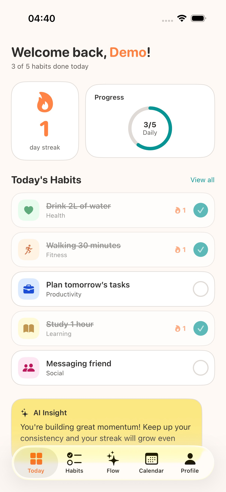
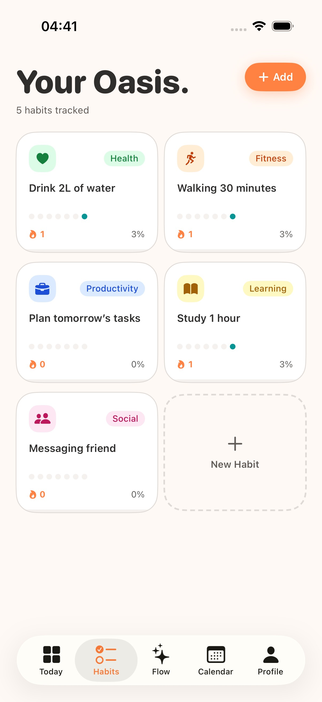
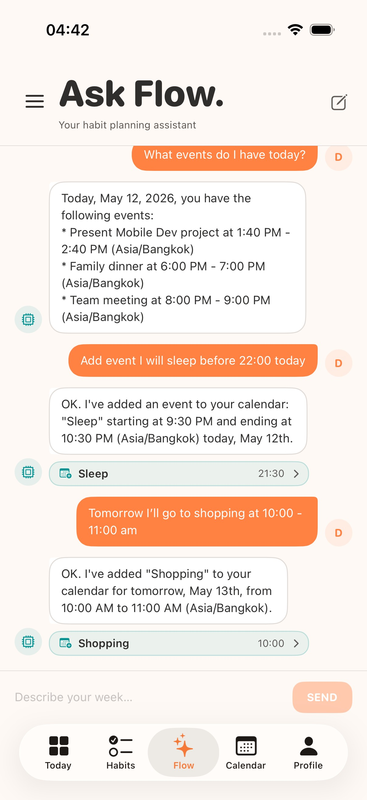
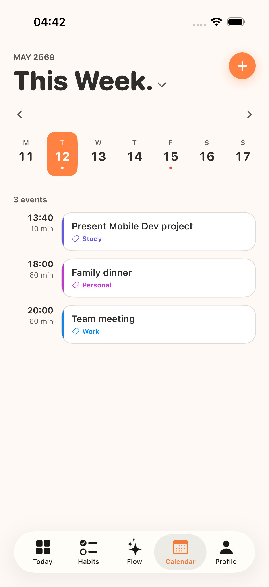
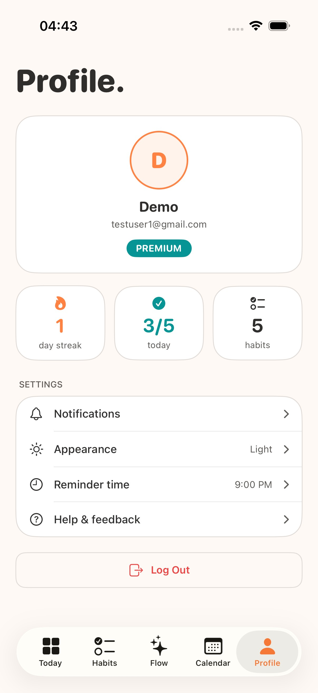
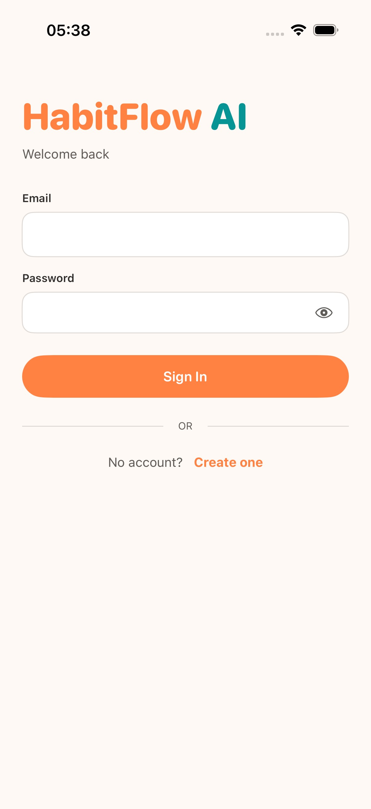

# HabitFlow AI

A personal habit tracker with an AI planning coach. Built as a native iOS app backed by a Server-Side Swift API.

**Stack:** Swift 6 + SwiftUI (iOS 17+) · Vapor 4 · PostgreSQL · Gemini 2.5 Flash

**Team:** Thanawat Tantijaroensin · Tanasatit Ngaosupathon

---

## Screenshots

| Today | Habits | AI Coach |
|---|---|---|
|  |  |  |
| Daily habit cards with streak flame and 7-day progress dots | Bento grid of all habits — tap to edit or delete | Natural language chat; AI reads your habits and writes calendar events |

| Calendar | Profile | Login |
|---|---|---|
|  |  |  |
| Week view with swipe navigation; category-coloured event cards | Appearance toggle and secure logout | JWT-based auth with secure Keychain storage |

---

## Layout

```
habitflow-mobile/
├── api/              # Vapor server (JWT auth, habits, calendar, AI coach)
├── ios/              # SwiftUI app
└── docs/prp/         # Phase plans
```

---

## Running locally

**Prerequisites:** Swift 6, Docker, Xcode 16+

### Backend

```bash
cd api
cp .env.example .env          # fill in JWT_SECRET and GEMINI_API_KEY
docker compose up -d          # Postgres 16 on port 5433
swift run App serve --hostname 127.0.0.1 --port 8080
```

Migrations run automatically on boot.

### iOS

Open `ios/HabitFlow.xcodeproj` in Xcode, select a simulator, and run. The app points to `http://localhost:8080` by default.

---

## API reference

### Auth

| Method | Path | Auth | Description |
|---|---|---|---|
| `POST` | `/auth/register` | — | `{email, password, name}` → `{token, user}` |
| `POST` | `/auth/login` | — | `{email, password}` → `{token, user}` |
| `POST` | `/auth/logout` | Bearer | Revokes token (denylist) |
| `GET`  | `/auth/me` | Bearer | Current user |

### Habits

| Method | Path | Auth | Description |
|---|---|---|---|
| `GET`    | `/habits` | Bearer | List active habits (paginated) |
| `POST`   | `/habits` | Bearer | Create habit (free limit: 5) |
| `PATCH`  | `/habits/:id` | Bearer | Update name / category / description |
| `DELETE` | `/habits/:id` | Bearer | Soft-delete habit |
| `POST`   | `/habits/:id/log` | Bearer | Log today's completion |
| `DELETE` | `/habits/:id/log` | Bearer | Remove today's log |
| `GET`    | `/habits/:id/stats` | Bearer | Streak + completion rate + week grid |

### Calendar

| Method | Path | Auth | Description |
|---|---|---|---|
| `GET`    | `/calendar` | Bearer | Events in date range `?start=&end=` |
| `POST`   | `/calendar` | Bearer | Create event |
| `PATCH`  | `/calendar/:id` | Bearer | Edit event (title, time, category, notes) |
| `DELETE` | `/calendar/:id` | Bearer | Soft-delete event |
| `POST`   | `/calendar/:id/restore` | Bearer | Restore deleted event |

### AI Coach (Premium)

| Method | Path | Auth | Description |
|---|---|---|---|
| `POST` | `/ai/chat` | Bearer (premium) | Chat message; AI can call `get_user_habits`, `get_calendar_events`, `write_calendar` |

### Dashboard

| Method | Path | Auth | Description |
|---|---|---|---|
| `GET` | `/dashboard` | Bearer | Today's habit completion summary |

### Admin

| Method | Path | Auth | Description |
|---|---|---|---|
| `GET`   | `/admin/users` | Bearer (admin) | List all users |
| `PATCH` | `/admin/users/:id/role` | Bearer (admin) | Set role: `free` · `premium` · `admin` |
| `DELETE`| `/admin/users/:id` | Bearer (admin) | Delete user |

---

## Roles

| Role | Habit limit | AI Coach | Admin panel |
|---|---|---|---|
| `free` | 5 | ✗ (paywall) | ✗ |
| `premium` | Unlimited | ✓ | ✗ |
| `admin` | Unlimited | ✓ | ✓ |

---

## Upgrading a user to Premium

No in-app payment flow — an admin promotes users via the API.

```bash
# 1. Get an admin token
TOKEN=$(curl -s -X POST http://localhost:8080/auth/login \
  -H 'Content-Type: application/json' \
  -d '{"email":"admin@habitflow.local","password":"changeme123"}' \
  | python3 -c "import sys,json; print(json.load(sys.stdin)['token'])")

# 2. List users to find the target ID
curl http://localhost:8080/admin/users -H "Authorization: Bearer $TOKEN"

# 3. Upgrade
curl -X PATCH http://localhost:8080/admin/users/<USER_ID>/role \
  -H "Content-Type: application/json" \
  -H "Authorization: Bearer $TOKEN" \
  -d '{"role":"premium"}'
```

---

## Running tests

Postgres must be running (`docker compose up -d`).

```bash
cd api

# All tests
swift test

# Unit tests only (streak algorithm — no DB required)
swift test --filter AppTests/HabitStatsServiceTests

# Integration tests
swift test --filter AppTests/HabitControllerTests
swift test --filter AppTests/CalendarEventControllerTests
```
